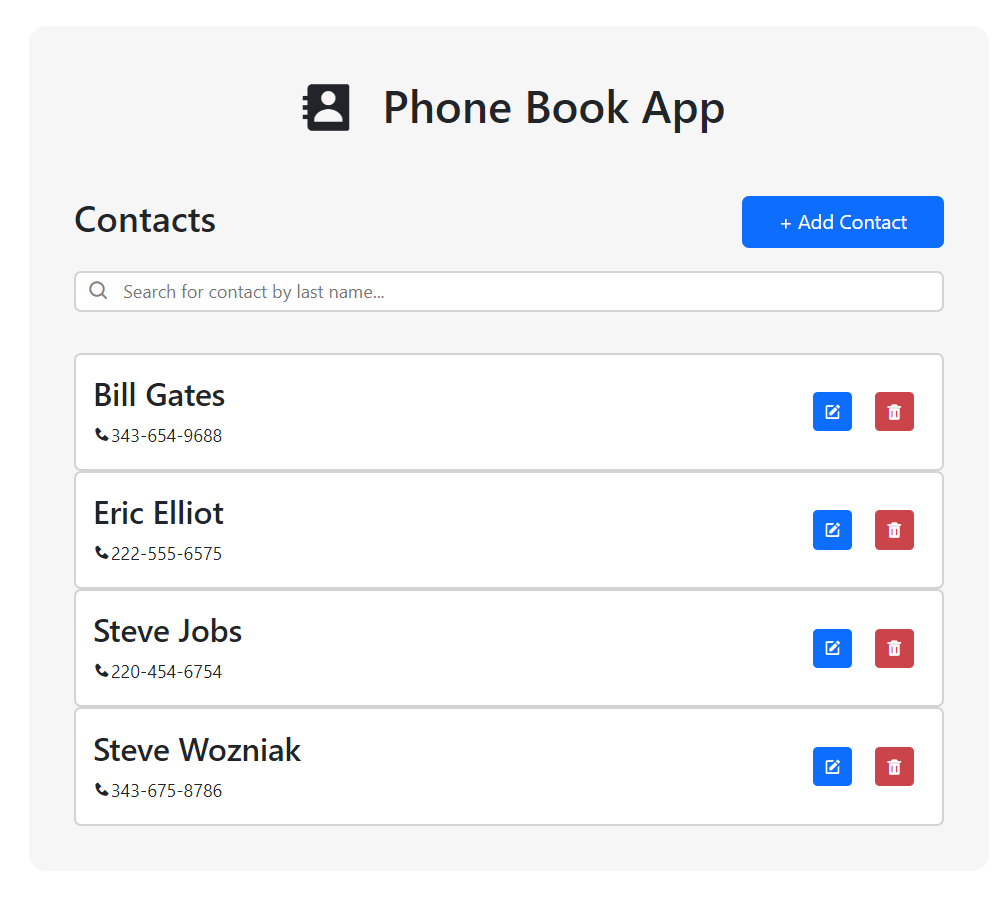
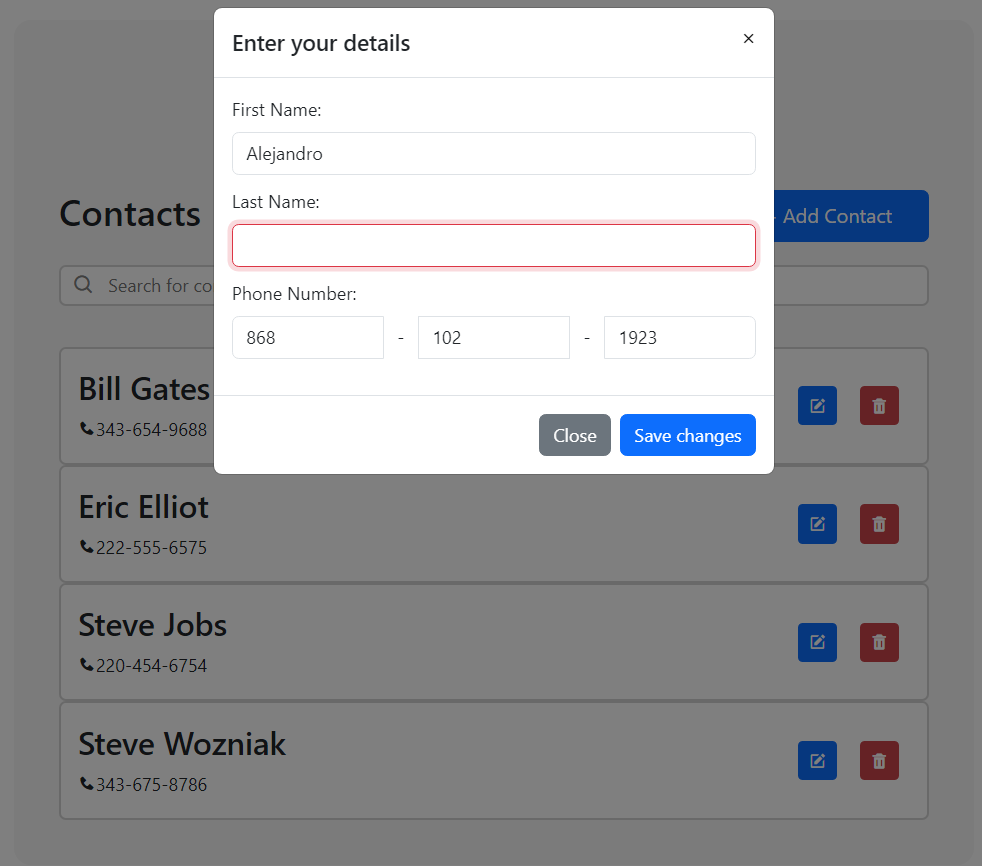
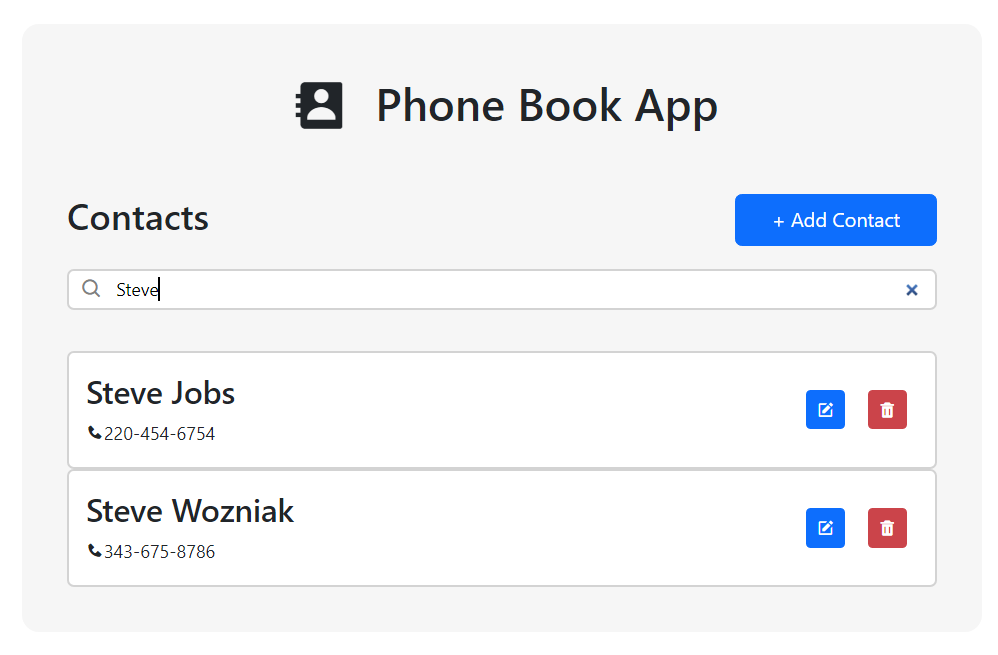
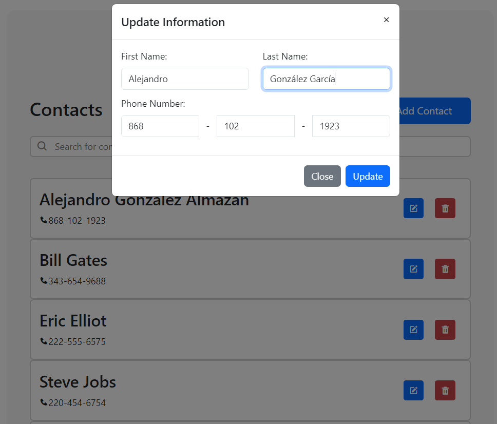
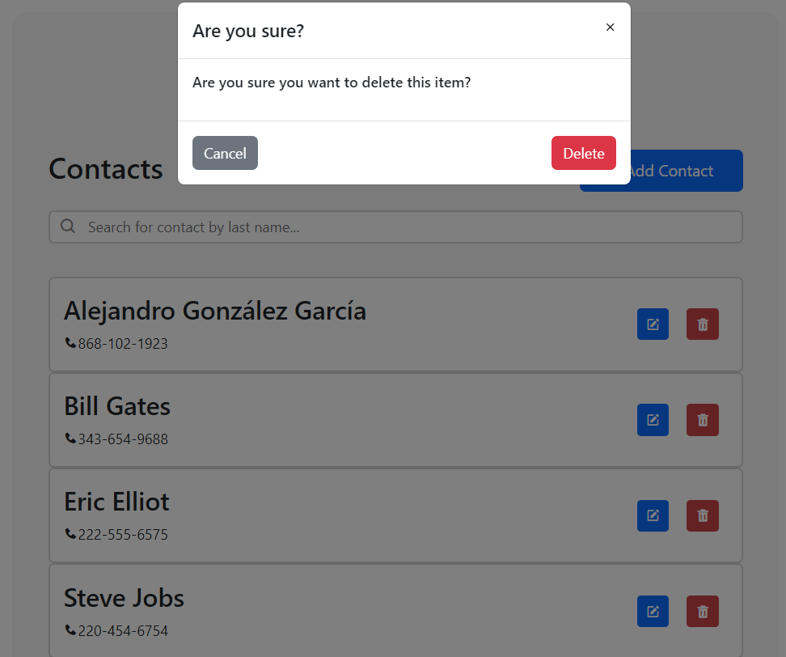

# CRUD-App

## Description
This application provides a form where you can enter in first name, last name, and phone number. It performs 4 basic operations: create new entries in your database, read the entries, update entries by editing any of the properties, and delete the entries.
The app should look should look something like this:

## Requirements and recommendations:
-   To run this application, you must have the following packages installed in **Python 3.11.2**: 
    -   **Flask** (version 2.2.2)
    -   **Flask-CORS** (version 3.0.10)
    -   **PyMySQL** (version 1.0.2).
-	You must use **MySQL8.0.32** for it to work.
-   This program utilizes the PyMySQL library to access a MySQL database and create an API. To run the program, it is necessary that the user and password are both set to 'root'. Alternatively, you can modify the code in *rest.py* and *table.py* to use different login credentials (the variables are **my_user** and **my_password**).
-   **If** you wish to modify the CSS styles, it is recommended that you install Live Sass Compiler by Glen Marks (in VS Code) or any other Live Sass Compilers. If you choose to use the one mentioned, ensure that you add the following code to your settings.json file, to ensure that the CSS is saved in the directory that the HTML file is requesting:

        "liveSassCompile.settings.formats":[
            {
                "format": "expanded",
                "extensionName": ".css",
                "savePath": "/dist"
            }
        ],

## To run the file:
-   To run it in the cmd (on Windows), open the cmd in the Python directory first and then execute the following commands:
'''bash
python table.py
set FLASK_APP=rest.py
python rest.py
'''
-   You can start the *index.html* file by simply clicking on it or by using a Live Server extension in your preferred IDE.

## MySQL table 
-   This is the query used to create the DATABASE in MySQL:

        CREATE DATABASE IF NOT EXISTS crud_app;

-   This is the query used to create the TABLE in MySQL:

        DROP TABLE IF EXISTS contacts;

        CREATE TABLE contacts (
            contact_id int NOT NULL AUTO_INCREMENT,
            phone_number CHAR(12) NOT NULL UNIQUE,
            first_name VARCHAR(50) NOT NULL,
            last_name VARCHAR(50) NOT NULL,
            date_registered DATETIME NOT NULL DEFAULT NOW(),
            PRIMARY KEY (contact_id)
        );

## Guide
-   To insert contet:

-   It will mark an error if not all the fields are entry:

-   You can use the search bar to filter among the contacts:

-   You can edit the contacts you previously inserted:

- You can delete any contact you want:

